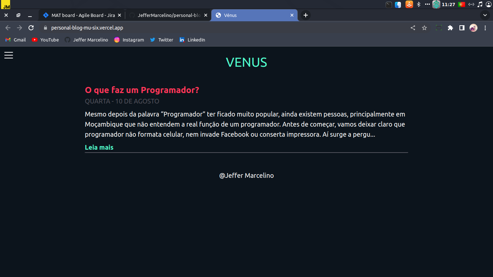
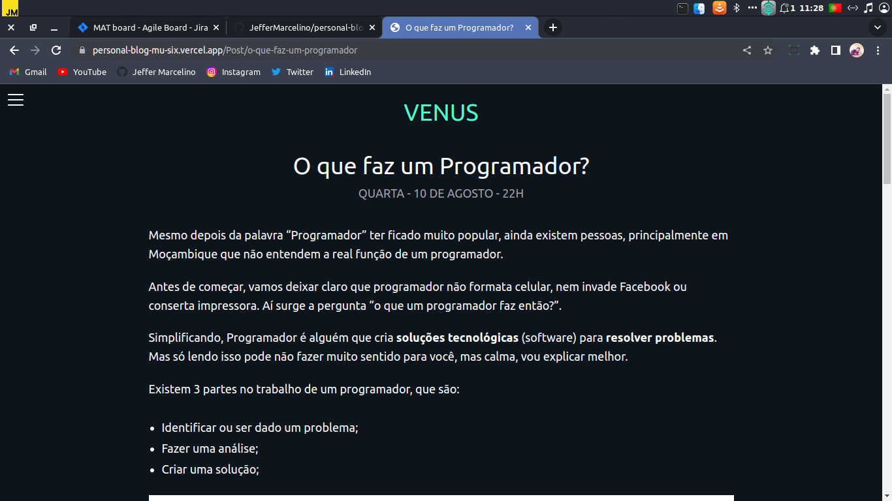
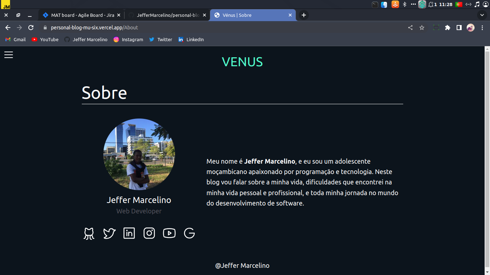

# Personal Blog

# Preview

  
  

  

 

## 🚀 Technologies

This project was developed with the following technologies:
- NextJS
- TailwindCSS
- Typescript
- GraphCMS

### API's
- [GraphCMS](https://app.hygraph.com/)

## 💻 Project

A simple blog.

 

You can acess it by clicking [here](https://personal-blog-mu-six.vercel.app/)

 

## 📝 License

This project is under MIT license. See the [LICENSE](./LICENSE) file for more details.

---

Made by ♥ :wave: [Jeffer Marcelino!](https://github.com/JefferMarcelino/)
